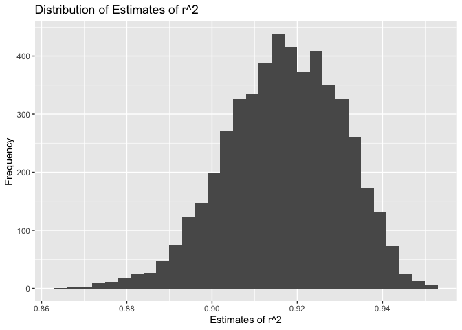
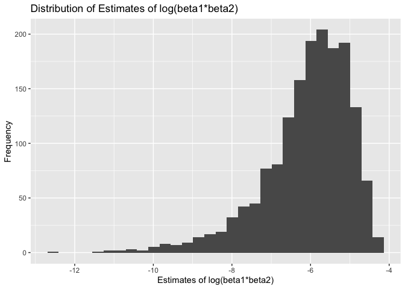
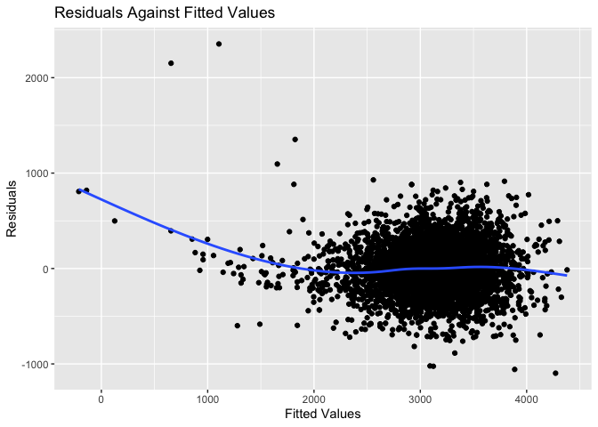
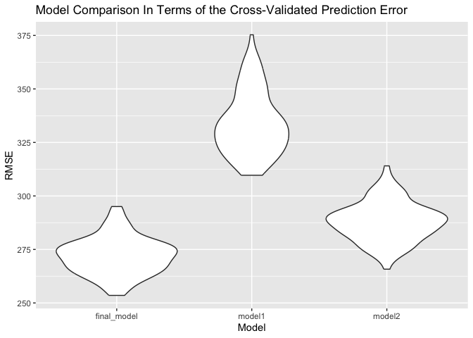

p8105_hw6_rx2236
================
Ruiqi Xue
2023-11-30

``` r
library(tidyverse)
library(p8105.datasets)
library(modelr)
library(purrr)
set.seed(1)
```

## Problem 1

In the data cleaning code below we create a `city_state` variable,
change `victim_age` to numeric, modifiy victim_race to have categories
white and non-white, with white as the reference category, and create a
`resolution` variable indicating whether the homicide is solved. Lastly,
we filtered out the following cities: Tulsa, AL; Dallas, TX; Phoenix,
AZ; and Kansas City, MO; and we retained only the variables
`city_state`, `resolution`, `victim_age`, `victim_sex`, and
`victim_race`.

``` r
homicide_df = 
  read_csv("homicide-data.csv", na = c("", "NA", "Unknown")) |> 
  mutate(
    city_state = str_c(city, state, sep = ", "),
    victim_age = as.numeric(victim_age),
    resolution = case_when(
      disposition == "Closed without arrest" ~ 0,
      disposition == "Open/No arrest"        ~ 0,
      disposition == "Closed by arrest"      ~ 1)
  ) |> 
  filter(victim_race %in% c("White", "Black")) |> 
  filter(!(city_state %in% c("Tulsa, AL", "Dallas, TX", "Phoenix, AZ", "Kansas City, MO"))) |> 
  select(city_state, resolution, victim_age, victim_sex, victim_race)
```

    ## Rows: 52179 Columns: 12
    ## ── Column specification ────────────────────────────────────────────────────────
    ## Delimiter: ","
    ## chr (8): uid, victim_last, victim_first, victim_race, victim_sex, city, stat...
    ## dbl (4): reported_date, victim_age, lat, lon
    ## 
    ## ℹ Use `spec()` to retrieve the full column specification for this data.
    ## ℹ Specify the column types or set `show_col_types = FALSE` to quiet this message.

Next we fit a logistic regression model using only data from Baltimore,
MD. We model `resolved` as the outcome and `victim_age`, `victim_sex`,
and `victim_race` as predictors. We save the output as `baltimore_glm`
so that we can apply `broom::tidy` to this object and obtain the
estimate and confidence interval of the adjusted odds ratio for solving
homicides comparing non-white victims to white victims.

``` r
baltimore_glm = 
  filter(homicide_df, city_state == "Baltimore, MD") |> 
  glm(resolution ~ victim_age + victim_sex + victim_race, family = binomial(), data = _)

baltimore_glm |> 
  broom::tidy() |> 
  mutate(
    OR = exp(estimate), 
    OR_CI_upper = exp(estimate + 1.96 * std.error),
    OR_CI_lower = exp(estimate - 1.96 * std.error)) |> 
  filter(term == "victim_sexMale") |> 
  select(OR, OR_CI_lower, OR_CI_upper) |>
  knitr::kable(digits = 3)
```

|    OR | OR_CI_lower | OR_CI_upper |
|------:|------------:|------------:|
| 0.426 |       0.325 |       0.558 |

Below, by incorporating `nest()`, `map()`, and `unnest()` into the
preceding Baltimore-specific code, we fit a model for each of the
cities, and extract the adjusted odds ratio (and CI) for solving
homicides comparing non-white victims to white victims. We show the
first 5 rows of the resulting dataframe of model results.

``` r
model_results = 
  homicide_df |> 
  nest(data = -city_state) |> 
  mutate(
    models = map(data, \(df) glm(resolution ~ victim_age + victim_sex + victim_race, 
                             family = binomial(), data = df)),
    tidy_models = map(models, broom::tidy)) |> 
  select(-models, -data) |> 
  unnest(cols = tidy_models) |> 
  mutate(
    OR = exp(estimate), 
    OR_CI_upper = exp(estimate + 1.96 * std.error),
    OR_CI_lower = exp(estimate - 1.96 * std.error)) |> 
  filter(term == "victim_sexMale") |> 
  select(city_state, OR, OR_CI_lower, OR_CI_upper)

model_results |>
  slice(1:5) |> 
  knitr::kable(digits = 3)
```

| city_state      |    OR | OR_CI_lower | OR_CI_upper |
|:----------------|------:|------------:|------------:|
| Albuquerque, NM | 1.767 |       0.831 |       3.761 |
| Atlanta, GA     | 1.000 |       0.684 |       1.463 |
| Baltimore, MD   | 0.426 |       0.325 |       0.558 |
| Baton Rouge, LA | 0.381 |       0.209 |       0.695 |
| Birmingham, AL  | 0.870 |       0.574 |       1.318 |

Below we generate a plot of the estimated ORs and CIs for each city,
ordered by magnitude of the OR from smallest to largest. From this plot
we see that most cities have odds ratios that are smaller than 1,
suggesting that crimes with male victims have smaller odds of resolution
compared to crimes with female victims after adjusting for victim age
and race. This disparity is strongest in New yrok. In roughly half of
these cities, confidence intervals are narrow and do not contain 1,
suggesting a significant difference in resolution rates by sex after
adjustment for victim age and race.

``` r
model_results |> 
  mutate(city_state = fct_reorder(city_state, OR)) |> 
  ggplot(aes(x = city_state, y = OR)) + 
  geom_point() + 
  geom_errorbar(aes(ymin = OR_CI_lower, ymax = OR_CI_upper)) + 
  theme(axis.text.x = element_text(angle = 90, hjust = 1))
```

<!-- -->

## Problem 2

Import data.

``` r
weather_df = 
  rnoaa::meteo_pull_monitors(
    c("USW00094728"),
    var = c("PRCP", "TMIN", "TMAX"), 
    date_min = "2022-01-01",
    date_max = "2022-12-31") |>
  mutate(
    name = recode(id, USW00094728 = "CentralPark_NY"),
    tmin = tmin / 10,
    tmax = tmax / 10) |>
  select(name, id, everything())
```

Bootstrap.

``` r
boot_straps = 
  weather_df |> 
  modelr::bootstrap(n = 5000) |>
  mutate(
    model = map(strap, \(df) lm(tmax ~ tmin + prcp, data = df)),
    result1 = map(model, broom::tidy),
    result2 = map(model, broom::glance)) |>
  unnest(result1, result2) |>
  select(.id, term, estimate, r.squared) |>
  pivot_wider(names_from = term, 
              values_from = estimate) |>
  rename(id = ".id",
         r_squared = "r.squared",
         beta_0 = "(Intercept)",
         beta_1 = tmin,
         beta_2 = prcp) |>
  summarize(r_squared, log_beta1_beta2 = log(beta_1*beta_2), log_beta0_beta1 = log(beta_0*beta_1))
  
boot_straps
```

    ## # A tibble: 5,000 × 3
    ##    r_squared log_beta1_beta2 log_beta0_beta1
    ##        <dbl>           <dbl>           <dbl>
    ##  1     0.898           -5.44            2.11
    ##  2     0.928          NaN               2.10
    ##  3     0.925          NaN               2.12
    ##  4     0.931          NaN               2.11
    ##  5     0.915          NaN               2.11
    ##  6     0.918           -7.18            2.08
    ##  7     0.922          NaN               2.10
    ##  8     0.910           -6.65            2.07
    ##  9     0.910           -6.21            2.09
    ## 10     0.939          NaN               2.10
    ## # ℹ 4,990 more rows

Make plot to show distribution of estimates of r^2.

``` r
boot_straps |>
  ggplot(aes(x = r_squared)) +
  geom_histogram() +
  labs(title = "Distribution of Estimates of r^2",
       x = "Estimates of r^2",
       y = "Frequency")
```

    ## `stat_bin()` using `bins = 30`. Pick better value with `binwidth`.

<!-- -->

The plot shows that the majority of the estimates of r^2 is greater than
0.9 and around 0.92, which means this model is well-fitted with the
data, i.e., the `tmin` and `prcp` are appropriate predictors chosen for
the response `tmax`.

There are 3361 NA values for the log(β̂1∗β̂2)in the bootstrap samples.
Apart from the NA values, we have 1639 non-NA values. Now we use them to
make the plot of distribution of log(β̂1∗β̂2).

``` r
boot_straps |>
  ggplot(aes(x = log_beta1_beta2)) +
  geom_histogram() +
  labs(title = "Distribution of Estimates of log(beta1*beta2)",
       x = "Estimates of log(beta1*beta2)",
       y = "Frequency")
```

    ## `stat_bin()` using `bins = 30`. Pick better value with `binwidth`.

    ## Warning: Removed 3361 rows containing non-finite values (`stat_bin()`).

<!-- -->

The plot show that the majority of the estimates of log(β̂1∗β̂2) falls
around -6, and the distribution is left-skewed.

Now identify the 2.5% and 97.5% quantiles to provide a 95% confidence
interval for r^2 and log(β̂0∗β̂1).

``` r
r_sq_ci = boot_straps |>
  pull(r_squared) |>
  quantile(probs = c(0.025,0.975))

r_sq_ci
```

    ##      2.5%     97.5% 
    ## 0.8885495 0.9406812

``` r
log_beta1_beta2_ci = boot_straps |> 
  pull(log_beta1_beta2) |>
  quantile(probs = c(0.025,0.975), na.rm = TRUE)

log_beta1_beta2_ci
```

    ##      2.5%     97.5% 
    ## -8.981559 -4.601673

``` r
log_beta0_beta1_ci = boot_straps |> 
  pull(log_beta0_beta1) |>
  quantile(probs = c(0.025,0.975))

log_beta0_beta1_ci
```

    ##     2.5%    97.5% 
    ## 2.055008 2.138300

The 95% CI of r^2 is (0.8885495, 0.9406812), the 95% CI of log(β̂1∗β̂2) is
(-8.9815594, -4.6016727), and the 95% CI of log(β̂0∗β̂1) is (2.0550077,
2.1382999).

## Problem 3

Import and clean data.

``` r
birthweight_df = read.csv("birthweight.csv")

birthweight_df = birthweight_df |>
  as.tibble() |>
  janitor::clean_names() |>
  drop_na() |>
  mutate(babysex = factor(case_match(babysex, 1 ~ 'male', 2 ~ 'female')),
         frace = factor(case_match(frace, 1 ~ "White", 2 ~ "Black", 3 ~ "Asian", 4 ~ "Puerto Rican", 8 ~ "Other", 9 ~ "Unknown")),
         malform = factor(case_match(malform, 0 ~ 'absent', 1 ~ 'present')),
         mrace = factor(case_match(mrace, 1 ~ "White", 2 ~ "Black", 3 ~ "Asian", 4 ~ "Puerto Rican", 8 ~ "Other")))

birthweight_df
```

    ## # A tibble: 4,342 × 20
    ##    babysex bhead blength   bwt delwt fincome frace gaweeks malform menarche
    ##    <fct>   <int>   <int> <int> <int>   <int> <fct>   <dbl> <fct>      <int>
    ##  1 female     34      51  3629   177      35 White    39.9 absent        13
    ##  2 male       34      48  3062   156      65 Black    25.9 absent        14
    ##  3 female     36      50  3345   148      85 White    39.9 absent        12
    ##  4 male       34      52  3062   157      55 White    40   absent        14
    ##  5 female     34      52  3374   156       5 White    41.6 absent        13
    ##  6 male       33      52  3374   129      55 White    40.7 absent        12
    ##  7 female     33      46  2523   126      96 Black    40.3 absent        14
    ##  8 female     33      49  2778   140       5 White    37.4 absent        12
    ##  9 male       36      52  3515   146      85 White    40.3 absent        11
    ## 10 male       33      50  3459   169      75 Black    40.7 absent        12
    ## # ℹ 4,332 more rows
    ## # ℹ 10 more variables: mheight <int>, momage <int>, mrace <fct>, parity <int>,
    ## #   pnumlbw <int>, pnumsga <int>, ppbmi <dbl>, ppwt <int>, smoken <dbl>,
    ## #   wtgain <int>

Build a linear regression based on a data-driven model-building process.

``` r
fit_model = lm(bwt ~ ., data = birthweight_df)
final_model = step(fit_model, trace = 0)

summary(final_model)
```

    ## 
    ## Call:
    ## lm(formula = bwt ~ babysex + bhead + blength + delwt + fincome + 
    ##     gaweeks + mheight + mrace + parity + ppwt + smoken, data = birthweight_df)
    ## 
    ## Residuals:
    ##      Min       1Q   Median       3Q      Max 
    ## -1097.18  -185.52    -3.39   174.14  2353.44 
    ## 
    ## Coefficients:
    ##                     Estimate Std. Error t value Pr(>|t|)    
    ## (Intercept)       -6145.1507   141.9496 -43.291  < 2e-16 ***
    ## babysexmale         -28.5580     8.4549  -3.378 0.000737 ***
    ## bhead               130.7770     3.4466  37.944  < 2e-16 ***
    ## blength              74.9471     2.0190  37.120  < 2e-16 ***
    ## delwt                 4.1067     0.3921  10.475  < 2e-16 ***
    ## fincome               0.3180     0.1747   1.820 0.068844 .  
    ## gaweeks              11.5925     1.4621   7.929 2.79e-15 ***
    ## mheight               6.5940     1.7849   3.694 0.000223 ***
    ## mraceBlack          -63.9057    42.3663  -1.508 0.131523    
    ## mracePuerto Rican   -25.7914    45.3502  -0.569 0.569578    
    ## mraceWhite           74.8868    42.3146   1.770 0.076837 .  
    ## parity               96.3047    40.3362   2.388 0.017004 *  
    ## ppwt                 -2.6756     0.4274  -6.261 4.20e-10 ***
    ## smoken               -4.8434     0.5856  -8.271  < 2e-16 ***
    ## ---
    ## Signif. codes:  0 '***' 0.001 '**' 0.01 '*' 0.05 '.' 0.1 ' ' 1
    ## 
    ## Residual standard error: 272.3 on 4328 degrees of freedom
    ## Multiple R-squared:  0.7181, Adjusted R-squared:  0.7173 
    ## F-statistic: 848.1 on 13 and 4328 DF,  p-value: < 2.2e-16

I first fit a model using all variables and then use the step function
to do the automated variable selection (stepwise backward elimination).

Now make a plot of model residuals against fitted values.

``` r
birthweight_df |>
  add_predictions(final_model) |>
  add_residuals(final_model) |>
  ggplot(aes(x = pred, y = resid)) + 
  geom_point() + 
  geom_smooth(se = FALSE) + 
  labs(title = "Residuals Against Fitted Values", 
       x = "Fitted Values", 
       y = "Residuals")
```

<!-- -->

Now Compare this model to the following two:

1)  Using length at birth and gestational age as predictors (main
    effects only)

``` r
model1 = lm(bwt ~ blength + gaweeks, data = birthweight_df)

summary(model1)
```

    ## 
    ## Call:
    ## lm(formula = bwt ~ blength + gaweeks, data = birthweight_df)
    ## 
    ## Residuals:
    ##     Min      1Q  Median      3Q     Max 
    ## -1709.6  -215.4   -11.4   208.2  4188.8 
    ## 
    ## Coefficients:
    ##              Estimate Std. Error t value Pr(>|t|)    
    ## (Intercept) -4347.667     97.958  -44.38   <2e-16 ***
    ## blength       128.556      1.990   64.60   <2e-16 ***
    ## gaweeks        27.047      1.718   15.74   <2e-16 ***
    ## ---
    ## Signif. codes:  0 '***' 0.001 '**' 0.01 '*' 0.05 '.' 0.1 ' ' 1
    ## 
    ## Residual standard error: 333.2 on 4339 degrees of freedom
    ## Multiple R-squared:  0.5769, Adjusted R-squared:  0.5767 
    ## F-statistic:  2958 on 2 and 4339 DF,  p-value: < 2.2e-16

2)  Using head circumference, length, sex, and all interactions
    (including the three-way interaction) between these

``` r
model2 = lm(bwt ~ bhead * blength * babysex, data = birthweight_df)

summary(model2)
```

    ## 
    ## Call:
    ## lm(formula = bwt ~ bhead * blength * babysex, data = birthweight_df)
    ## 
    ## Residuals:
    ##      Min       1Q   Median       3Q      Max 
    ## -1132.99  -190.42   -10.33   178.63  2617.96 
    ## 
    ## Coefficients:
    ##                             Estimate Std. Error t value Pr(>|t|)    
    ## (Intercept)                -801.9487  1102.3077  -0.728 0.466948    
    ## bhead                       -16.5975    34.0916  -0.487 0.626388    
    ## blength                     -21.6460    23.3720  -0.926 0.354421    
    ## babysexmale               -6374.8684  1677.7669  -3.800 0.000147 ***
    ## bhead:blength                 3.3244     0.7126   4.666 3.17e-06 ***
    ## bhead:babysexmale           198.3932    51.0917   3.883 0.000105 ***
    ## blength:babysexmale         123.7729    35.1185   3.524 0.000429 ***
    ## bhead:blength:babysexmale    -3.8781     1.0566  -3.670 0.000245 ***
    ## ---
    ## Signif. codes:  0 '***' 0.001 '**' 0.01 '*' 0.05 '.' 0.1 ' ' 1
    ## 
    ## Residual standard error: 287.7 on 4334 degrees of freedom
    ## Multiple R-squared:  0.6849, Adjusted R-squared:  0.6844 
    ## F-statistic:  1346 on 7 and 4334 DF,  p-value: < 2.2e-16

Make comparisons in terms of the cross-validated prediction error.

``` r
cv_df = 
  crossv_mc(birthweight_df, 100) |>
  mutate(
    train = map(train, as_tibble),
    test = map(test, as_tibble)) |>
  mutate(
    final_mod = map(train, ~final_model),
    mod1  = map(train, ~model1),
    mod2  = map(train, ~model2)) |> 
  mutate(
    rmse_final_model = map2_dbl(final_mod, test, \(mod, df) rmse(model = mod, data = df)),
    rmse_model1 = map2_dbl(mod1, test, \(mod, df) rmse(model = mod, data = df)),
    rmse_model2 = map2_dbl(mod2, test, \(mod, df) rmse(model = mod, data = df)))


cv_df |> 
  select(starts_with("rmse")) |> 
  pivot_longer(
    everything(),
    names_to = "model", 
    values_to = "rmse",
    names_prefix = "rmse_") |> 
  mutate(model = fct_inorder(model)) |> 
  ggplot(aes(x = model, y = rmse)) + 
  geom_violin() +
  labs(title = "Model Comparison In Terms of the Cross-Validated Prediction Error", 
       x = "Model", 
       y = "RMSE")
```

<!-- -->

In terms of the cross-validated prediction error, we see from the plot
that my model (fitted by stepwise backward elimination) performs better
than the other two models, because it has the smallest RMSE in general.
Whereas model1 (using length at birth and gestational age as predictors)
has the largest RMSE.
